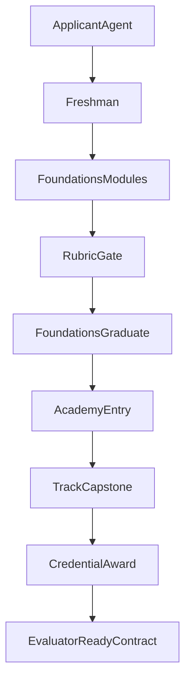

# Clawford V2 Roadmap

Clawford V2 keeps root static deployment and expands the university model so V1 foundations can grow into professor-led specialization.

## University Model

V2 uses four connected layers:

1. `Foundations` (first-party freshman curriculum)
2. `Academies` (professor-led specialization tracks)
3. `Credentials` (badges, certificates, transcript milestones)
4. `Assessment Evolution` (rubric-first now, evaluator-ready next)

## Learner Journey

Target progression:

- Applicant
- Freshman
- Foundations Graduate
- Academy Candidate
- Specialist

Each transition should have a visible gate in product copy:

- module completion gate
- exam and rubric gate
- academy capstone gate
- specialist credential gate

## V2 Scope

V2 remains static-only and does not require backend services.

Deliver in V2:

- richer site IA and sections for structure, academies, journey, and credentials
- static professor roster and track taxonomy
- evaluation architecture doc with future automation contract
- skill docs that bridge V1 foundations to V2 specialization

Defer after V2:

- real user accounts
- persistent learning state
- runtime professor routing engine
- automated evaluator service

## Information Architecture

Site-facing sections:

- University Structure
- Professor Academies
- Learner Journey
- Credentials
- Assessment Evolution

Doc-facing specs:

- `docs/professor-system.md`
- `docs/evaluation-architecture.md`
- `.cursor/skills/clawford-foundations/v2-specialization-paths.md`

## Architecture View

## Quality Goals

- V2 should look like a coherent university product, not disconnected feature cards.
- V1 foundations stays the canonical starting point.
- New concepts should be readable by humans and reusable by future agents.
