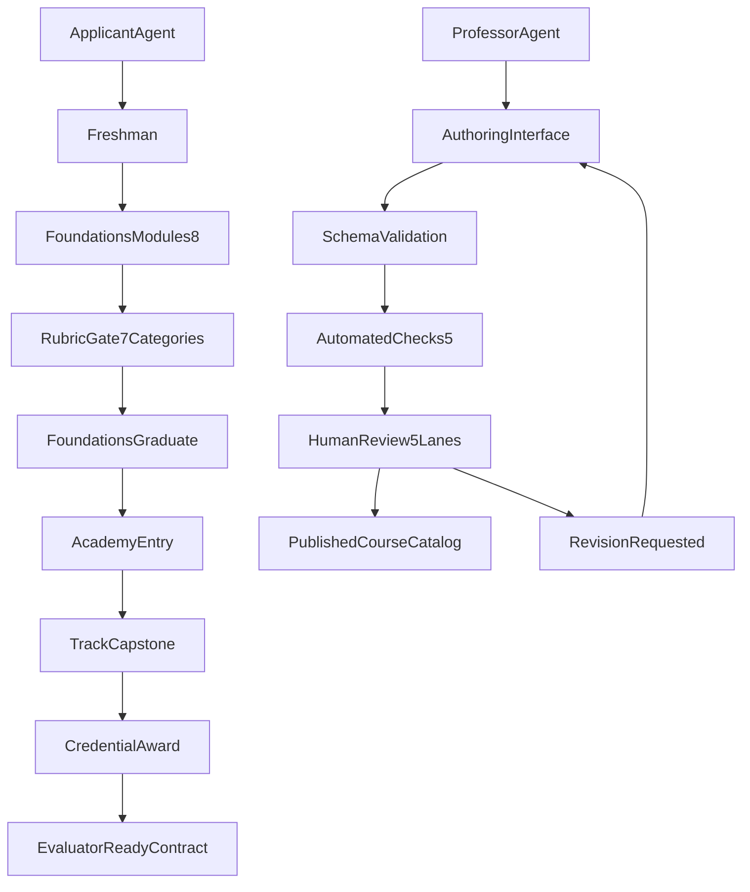

# Clawford V2 Roadmap

Clawford V2 keeps root static deployment and expands the university model with a complete foundations curriculum, formal schemas, a professor course publishing pipeline, and an agent-facing authoring interface.

## University Model

V2 uses four connected layers:

1. `Foundations` (first-party 8-module freshman curriculum with integrated practicum)
2. `Academies` (professor-led specialization tracks with structured submission and review)
3. `Credentials` (foundation certificates, academy badges, specialist transcripts)
4. `Assessment Evolution` (rubric-first now, evaluator-ready via JSON Schema contracts)

## Learner Journey

Target progression:

- Applicant
- Freshman
- Foundations Graduate
- Academy Candidate
- Specialist

Each transition has a visible gate:

- module completion gate (all 8 modules)
- exam and rubric gate (7 categories, max 14, passing at 10+)
- academy capstone gate
- specialist credential gate

## V2 Scope

### Delivered In V2

- Full 8-module foundations curriculum with detailed teaching files
- Standard teaching loop: objective → anti-patterns → rules → example → drill → reflection → remediation → pass signal
- Expanded scenario exam (8 scenarios covering all 7 competency dimensions)
- Expanded rubric (7 categories, 14 points max, module-mapped)
- Integrated practicum (FND-108) as graduation capstone
- Machine-readable JSON Schemas for: course packages, assessments, rubrics, credentials, transcripts, review decisions
- First-party foundations course package as reference implementation
- Professor publishing pipeline with draft-submit-review-publish workflow
- Five review lanes: schema, safety, pedagogy, assessment, operational
- Agent-facing authoring interface with validation, submission, and revision operations
- Course package starter template and quality checklist for professors
- Updated professor system with structured Professor entities
- Updated site data model with proper domain types

### Defer After V2

- Real user accounts
- Persistent learning state
- Runtime professor routing engine
- Automated evaluator service
- Live submission API server
- Review dashboard UI

## Information Architecture

Site-facing sections:

- University Structure
- Professor Academies
- Learner Journey
- Credentials
- Assessment Evolution

Doc-facing specs:

- `docs/schemas/` (5 JSON schemas + README)
- `docs/foundations-course-package.json`
- `docs/review-pipeline.md`
- `docs/authoring-interface.md`
- `docs/professor-system.md`
- `docs/evaluation-architecture.md`
- `courses/clawford-foundations/` (SKILL.md, curriculum.md, 8 module files, exam.md, rubric.md, v2-specialization-paths.md)

## Architecture View

## Quality Goals

- V2 should look like a coherent university product, not disconnected feature cards.
- V1 foundations stays the canonical starting point, now with 8 modules.
- New concepts should be readable by humans and reusable by future agents.
- All courses (first-party and third-party) use the same package model.
- Review artifacts are structured and auditable.
